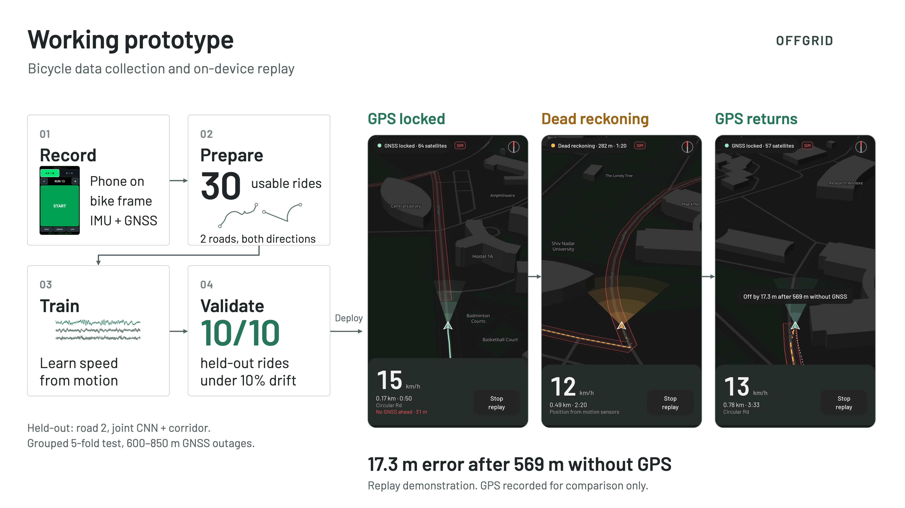
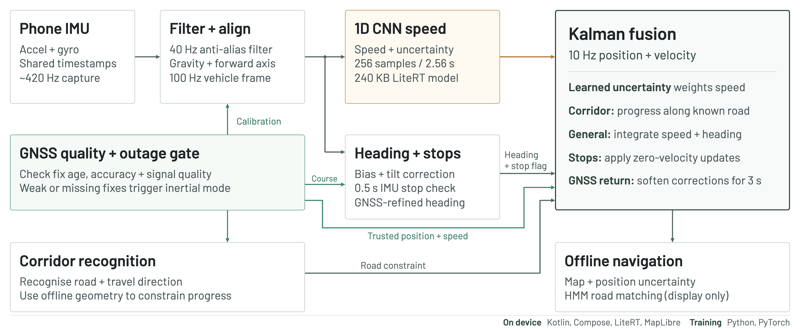
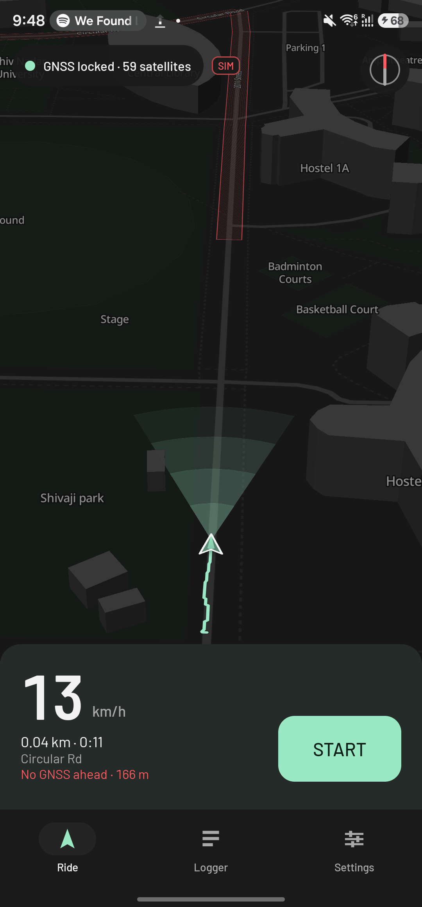
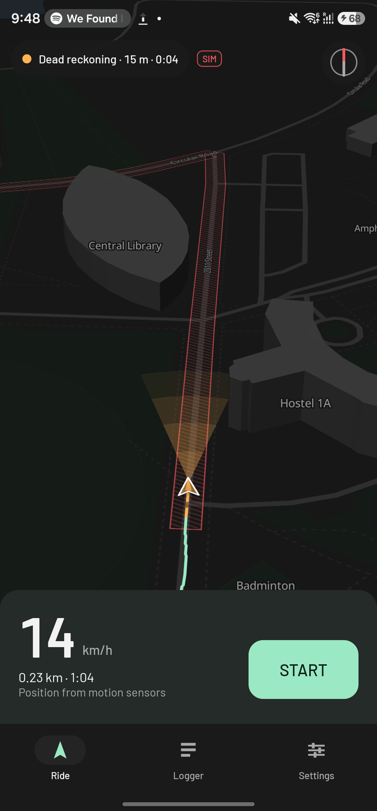
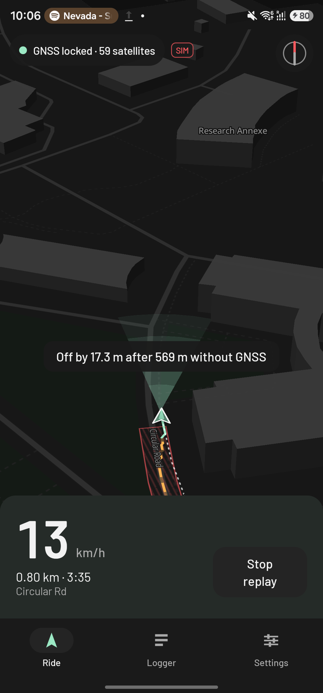
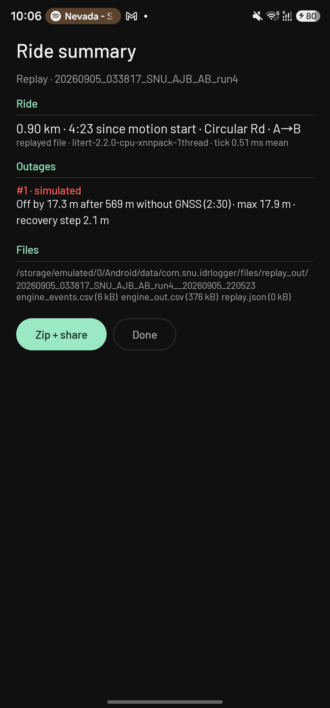
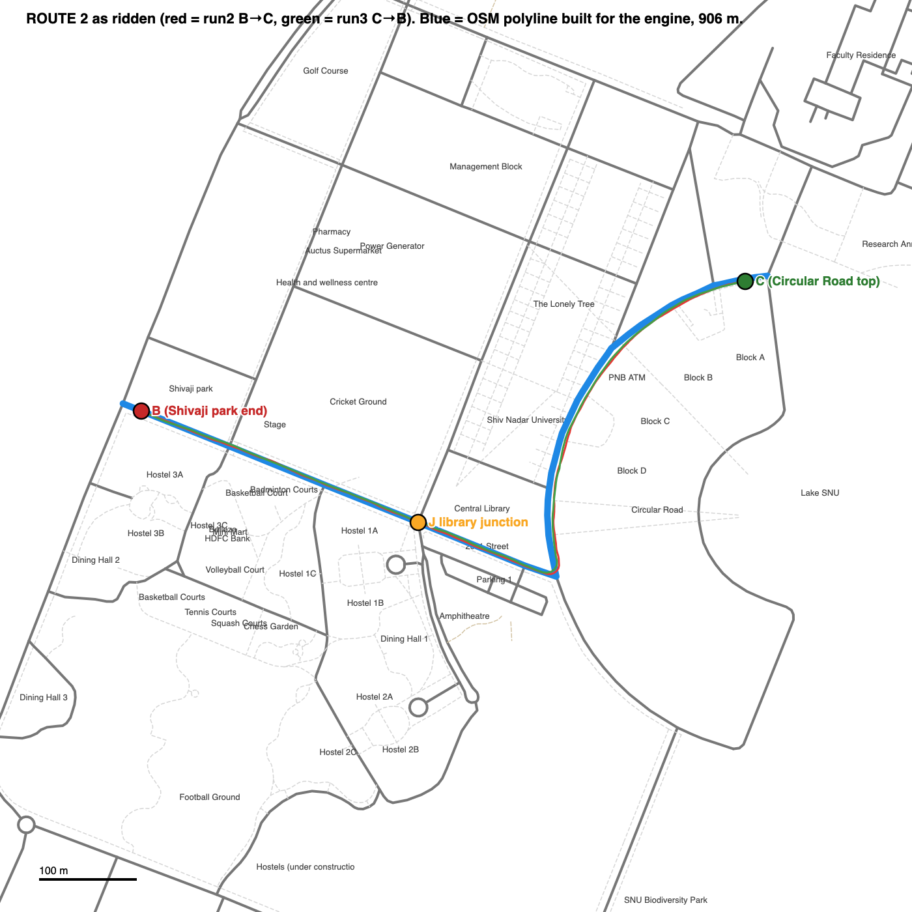
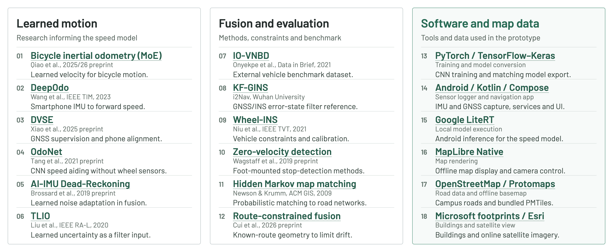

# OFFGRID — intelligent dead reckoning for smartphones

**Smart India Hackathon 2026 · Team OFFGRID (26168) · "AI-ML based Intelligent Dead Reckoning System for seamless navigation" · Theme: Smart Vehicles · Category: Software**

A phone that keeps navigating after the satellites go away.

When GNSS drops — a tunnel, an underpass, a street with tall buildings on both sides — a phone has nothing left but its own accelerometer and gyroscope, and integrating those is hopeless. We measured it on our own hardware: a 70-second ride, GNSS withheld from the first second, pure inertial integration ends up **2,889 m** from where the bike actually stopped. The bike travelled 197 m.

OFFGRID replaces the integration step with a small neural network that reads forward speed straight out of the vibration pattern of a moving vehicle, and feeds it — with its own uncertainty — into a Kalman filter alongside gyro heading, offline road geometry and a zero-velocity detector. Over 600–850 m outages, four times longer than that baseline ride, the error settles at **1.5 % of distance travelled**, and every single held-out ride stays under 10 %.

Everything here is measured. The rides, the model, the evaluation harness, the Android app and the numbers below are all in this repository.

<p align="center">
  
</p>

---

## The result in one table

Held-out rides only. "Drift" is endpoint error as a percentage of the distance covered while GNSS was withheld. Full tables, per-run, per-cut, per-mode, are in [`docs/11_ENGINE_RESULTS.md`](docs/11_ENGINE_RESULTS.md).

| | Road 1 (20 rides, ~200 m outages) | Road 2 (10 rides, 600–850 m outages) |
|---|---|---|
| Speed model MAE | **0.179 m/s** | **0.164 m/s** |
| Drift, median — best mode | **2.58 %** (general 2-D) | **1.52 %** (corridor) |
| Drift, median — other mode | 4.31 % (corridor) | 1.73 % (general 2-D) |
| Drift, worst ride | 6.82 % | 5.73 % |
| Rides under the 10 % target | **20 / 20**, both modes | **10 / 10**, both modes |
| Heading error at the cut | < 3° on 19/20 | < 3° on 9/10 |

Both modes are published because the corridor mode assumes the road is known and the general mode does not. On road 1 the general mode is the stronger of the two; on road 2, over four times the distance and through a 105° junction turn, the corridor mode is. GNSS is withheld from 30 s after motion start in every row.

And the baselines we had to beat, measured on our own data ([`docs/06_BASELINE_run3.md`](docs/06_BASELINE_run3.md)):

| Method | Endpoint error after a 70 s / 197 m outage |
|---|---|
| Double-integrate the accelerometer | 2,889 m |
| Forward-axis integration only | 785 m |
| Gyro heading + hold the last known speed | 26 m (13.3 %) |
| Gyro heading + a *perfect* speed oracle | 1.2 m (0.6 %) |
| **OFFGRID (learned speed + fusion)** | **~2 % of distance, on held-out rides** |

That third row is the honest bar: dead reckoning is not a heading problem, it is a **speed** problem. A MEMS gyro, de-biased against a genuinely still 15-second window, holds heading to about 2° over a minute. Speed is where everything is won or lost, and that is where the model goes.

On the phone, at 10 Hz, the whole thing costs **0.83 ms per tick** and the model itself **0.074 ms per inference**.

---

## How it works

<p align="center">
  
</p>

**Sensing.** The phone's accelerometer and gyroscope run at ~420 Hz off a shared monotonic clock. A causal 4th-order Butterworth at 40 Hz anti-aliases them down to a uniform 100 Hz grid. Nothing acausal is ever used — the offline engine and the live app see the same samples in the same order.

**Alignment.** Nobody mounts a phone squarely. Gravity during the pre-ride stand gives roll and pitch; the yaw of the phone relative to the bike comes from the first straight acceleration and is then refined from the sway axis of the rider's own pedalling. The phone gets re-levelled every few seconds while riding, and a moved-phone rule catches it if the mount shifts mid-ride. One of our rides had the phone seated 18° differently from every other; the alignment absorbed it.

**Speed from motion.** A 1-D CNN reads the last 2.56 s of six-channel bike-frame IMU (256 samples × 6, gravity and gyro bias left in) and returns a speed and a log-variance. 57,602 parameters, 240 KB as a LiteRT model, four conv layers and two dense layers, trained with a Gaussian negative-log-likelihood loss so the uncertainty it reports is the uncertainty the filter uses. A hard physical rule overrides it at standstill: vibration RMS below 0.6 m/s² and gyro RMS below 0.06 rad/s over half a second means the vehicle is stopped, no matter what the network says.

**Heading.** A quaternion propagated from the gyro at 100 Hz, with the bias taken from the stationary stand, tilt gated against gravity, and yaw corrected from GNSS course whenever GNSS is healthy and the vehicle is moving faster than 1.5 m/s. We tried carrying a gyro-bias state through the outage and measured it making things *worse* over 200 s outages — it is not in the shipped design. That finding is written up in [`docs/11_ENGINE_RESULTS.md`](docs/11_ENGINE_RESULTS.md) step 3.

**Fusion.** An error-state Kalman filter in one of two modes. On a recognised road it runs a 1-D corridor state — arc length along the polyline plus speed — so lateral error cannot accumulate at all. Off-corridor it runs a full 2-D state on integrated speed and heading. The speed model's own σ weights its measurement update. Stops trigger zero-velocity updates. GNSS positions and speeds are gated on fix age, horizontal accuracy, satellite count and C/N0, and when GNSS comes back the measurement noise is inflated 4× for three seconds so the marker glides back instead of jumping. The displayed track through an outage is never rewritten after the fact.

**Display.** An HMM map-matcher (Newson–Krumm) runs over the campus road graph, but it is display-only — it never feeds back into the estimate. We measured it hurting on road 1 and left it out of the loop rather than quietly using it to flatter the numbers.

The full mathematical specification — every constant, every gate, every state transition, written so it can be ported line by line — is [`docs/12_ENGINE_SPEC_for_kotlin.md`](docs/12_ENGINE_SPEC_for_kotlin.md).

---

## What's in this repository

```
engine/        The reference implementation, in Python. This is the truth: QA, alignment,
               heading, the speed-model training and sweep, the fusion filter, the corridor
               filter, map matching, the replay harness and the evaluation harness.
IDRLogger/     Android sensor logger. 21 streams at native rates, foreground service,
               A/B anchors, per-ride manifest. This is what collected the data.
IDRNav/        Android navigation app (Kotlin + Compose + MapLibre + LiteRT). A pure-JVM
               `:engine` module that reproduces the Python engine to 7 mm, and an app
               module that runs it live at 10 Hz on an offline map.
data/          Every ride, raw. 30 quality-controlled sessions across two roads, the
               processed tables, the trained models, the QA reports and the evaluation
               outputs. See data/README.md.
tools/         Model export, map-asset generation, style building, comparison scripts.
docs/          The engineering record: plans, specs, research reviews, and the results
               documents with every number in them. See docs/README.md.
docs/slides/   The submitted SIH deck.
```

---

## The apps

**IDR Logger** collects the data. It writes 21 sensor and GNSS streams to CSV at whatever rate the hardware will give (418.8 Hz for accelerometer and gyroscope on a Galaxy S23 Ultra, 1 Hz GNSS fixes with per-satellite C/N0), with a scripted protocol around each ride: a 15-second stationary stand at each end for gyro-bias estimation, direction and route tagging, and an anchor check against the known endpoints. Zero dropped rows across 33 recorded sessions. Spec: [`docs/01_APP_SPEC_logger.md`](docs/01_APP_SPEC_logger.md).

**IDR Nav** is the demonstrator. It runs the engine live on the phone at 10 Hz over an offline basemap (PMTiles, 812 KB for the whole campus) with a course-up 3-D camera, shows the position with an uncertainty ring, and switches to dead reckoning when GNSS goes — either genuinely, or inside a pre-declared band on a known road so the outage can be shown on video with GNSS still recording as the reference. When GNSS returns, the app draws the truth alongside the dead-reckoned track and states the miss distance on screen.

<p align="center">
  
  
  
  
</p>

A recorded replay of road-2 run 4, run back on the device: **off by 17.3 m after 569 m and 151 seconds without GNSS.** (That is a training ride replayed with live online alignment — a demonstration figure, not a held-out result. The held-out numbers are the table at the top.)

The APK is on the [Releases page](../../releases). It is a debug build, arm64-v8a, and it needs Android 10 or newer plus location permission.

### Conformance: the Kotlin port is the Python engine

The port was not trusted, it was tested. On the same inputs, the JVM engine reproduces the Python reference to **7 mm** over a 2,977-tick session, with identical mode transitions and heading within 0.15°. The phone reproduces the JVM to **1 mm**. The LiteRT model matches the Kotlin CNN to 1.9e-6 and both match PyTorch to 1.4e-6. Details in [`docs/16_APP_RESULTS.md`](docs/16_APP_RESULTS.md) §3.

---

## Running it

### The Python engine

```bash
python3 -m venv .venv && .venv/bin/pip install numpy pandas scipy matplotlib scikit-learn torch onnxruntime
```

```bash
# Quality-check a set of rides
.venv/bin/python engine/qa.py data/route2/sessions --tag route2

# Replay every ride with GNSS withheld from 30 s after motion start
.venv/bin/python engine/replay.py --all --tag route2 --mode corridor

# Train and evaluate the speed model
.venv/bin/python engine/speed_model/train.py --tag route1+route2 --split loro
```

### The Android apps

```bash
export JAVA_HOME=/opt/homebrew/opt/openjdk@21 ANDROID_HOME=$HOME/Library/Android/sdk
cd IDRNav && ./gradlew :engine:test          # JVM conformance + model tests
./gradlew :app:assembleDebug && adb install -r app/build/outputs/apk/debug/app-debug.apk
```

Gradle 8.14.3, AGP 8.13.2, Kotlin 2.2.10, compileSdk 36, minSdk 29. Build instructions and the adb-driven replay harness are in [`docs/16_APP_RESULTS.md`](docs/16_APP_RESULTS.md) §2.

---

## The data

30 quality-controlled rides — **71 minutes and 15.0 km** of riding — on two campus roads at Shiv Nadar University, each ridden in both directions, phone in the bottle cage of a bicycle, GNSS recorded throughout as reference.

| | Road 1 | Road 2 |
|---|---|---|
| Rides kept / recorded | 20 / 21 | 10 / 12 |
| Length | 316 m | 853 m |
| Shape | straight, S-bend, 110° arc | 440 m straight, 105° junction turn, 480 m straight, arc |
| Riding time | 28.5 min | 42.6 min |
| Distance | 6.29 km | 8.73 km |

Nothing was silently dropped. Every ride carries a QA verdict with the reason attached — `data/qa/route1_flags.md` and `route2_flags.md` list every warning on every run, and the three excluded rides (one aborted, two false starts) are named and explained. The full inventory, formats and regeneration instructions are in [`data/README.md`](data/README.md).

A full clone is around 500 MB because the raw rides are in it. To skip the data:

```bash
git clone --filter=blob:none --sparse https://github.com/VaradhaCodes/offgrid.git
cd offgrid && git sparse-checkout set engine IDRNav IDRLogger tools docs
```

<p align="center">
  
</p>

---

## What we found that surprised us

**The 15-second stand is load-bearing.** Four road-1 rides drifted past 10 %, and all four failed the same way: the rider had slowly rotated the bike during the "stand still" window, poisoning the gyro-bias estimate by 0.2–0.5 °/s. Over a 60-second outage that is 12–30° of heading. The fix was half protocol (hold the brakes, do not turn the bars) and half engine (a motion-rejecting bias estimator plus continuous refinement from GNSS course while GNSS is healthy).

**Training on a second road made the first road better.** Adding 42 minutes of a completely different road improved the road-1 speed MAE from 0.195 to 0.179 m/s. More riding data is still the highest-value thing we could add.

**The scale-factor state is not worth it here.** A learned per-run speed scale correction is standard practice for wheel odometers and it improves our medians — but it flips individual runs both ways and worsens the worst case. It stays off for the bicycle, and on only for a grossly biased external source, where it took IO-VNBD from 24 % to 14 %.

**A sign error in one constant invalidated a whole round of results.** GNSS Doppler speed lags the IMU. We measured the lag at 0.2 s, corrected it with the wrong sign, and shipped a model that predicted speed 0.8 s late. It surfaced only when road 2 was added, and everything on both roads had to be re-run. The original road-1 sections are kept in the results document as the record rather than quietly overwritten.

---

## Honest limits

- **One vehicle, one rider, two roads.** Everything here is a bicycle, a Galaxy S23 Ultra, and 1.2 km of campus road. Every session carries `rider_id = rider_1`, so a rider-held-out test was impossible; cross-road transfer (which also crossed an 18° mount-seating change) is the held-out-condition test we could run.
- **Outages are simulated on a known corridor.** GNSS is recorded throughout and withheld from the estimator. That is the honest way to get ground truth, and it is what the numbers are; it is not the same as a genuine tunnel.
- **Corridor mode assumes the road is known.** It is the stronger mode and the demo mode, and its assumption is fair for the deployment case the problem statement describes — tunnels, underpasses and metro sections are fixed corridors. The general 2-D mode runs without it and holds 2.8 % on road 2; the numbers for both are published.
- **The map matcher is display-only** and was measured hurting on road 1.
- **No car data of our own.** The external-IMU evidence is IO-VNBD, a published vehicle benchmark ([`engine/iovnbd.py`](engine/iovnbd.py)).

---

## Research behind it

The design decisions are traceable to fetched, verified sources rather than to intuition. [`docs/research/`](docs/research/) holds seven reviews — training recipes, mobile export, ESKF and scale factor, stop detection, map UI, the Android map stack, and campus map data — each of which records what was actually fetched and marks anything it could not verify as `UNVERIFIED`. The consolidated bibliography is [`docs/03_REFERENCES.md`](docs/03_REFERENCES.md).

<p align="center">
  
</p>

---

## The submission

The six-slide SIH idea submission is in [`docs/slides/`](docs/slides/), as the exported PDF and as page images.

| | |
|---|---|
| [Proposed solution](docs/slides/pages/2_proposed_solution.png) | [Architecture](docs/slides/pages/3_architecture.png) |
| [Working prototype](docs/slides/pages/4_working_prototype.png) | [Viability and impact](docs/slides/pages/5_viability_and_impact.png) |
| [Research and references](docs/slides/pages/6_research_and_references.png) | [Full deck (PDF)](docs/slides/SIH2026_OFFGRID_26168.pdf) |

The full-resolution slide artwork and the code that generates it are in [`docs/diagrams/`](docs/diagrams/).

---

## Licence

Code and documentation in this repository are released under the [MIT Licence](LICENSE).

The recorded ride data under `data/` is released under [CC BY 4.0](https://creativecommons.org/licenses/by/4.0/) — use it, and cite this repository.

Third-party components keep their own licences: OpenStreetMap road data (ODbL), Microsoft Building Footprints (ODbL), Esri satellite imagery (used online, under Esri's terms), MapLibre Native (BSD-2), LiteRT (Apache-2.0), Barlow (OFL). The IO-VNBD dataset is not redistributed here; see [`data/README.md`](data/README.md).
